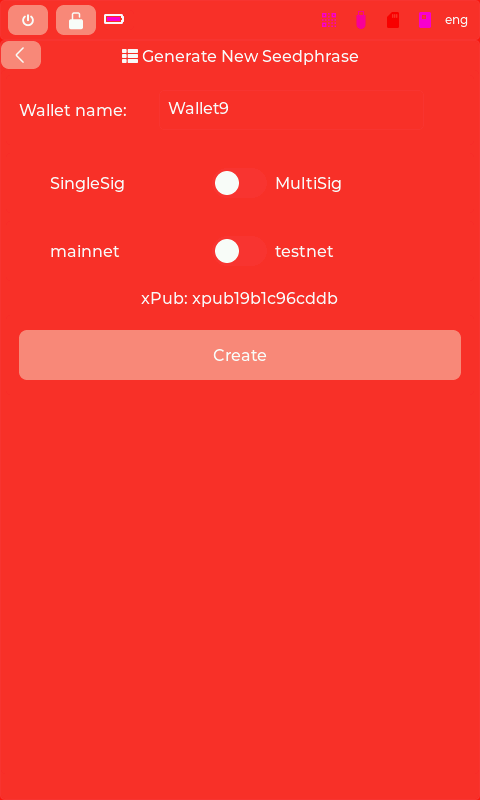

# Generate New Seedphrase

## Purpose
Create a new BIP39 mnemonic seed with wallet configuration.

## User Actions
- **Wallet name** - Label for this wallet
- **SingleSig/MultiSig** - Signing scheme selection
- **mainnet/testnet** - Bitcoin network selection
- **Create** - Generate seed and show mnemonic

## Flow
1. Configure wallet parameters
2. Generate entropy and derive seed
3. Display mnemonic for backup
4. Optionally add passphrase (set_passphrase)
5. Confirm backup complete