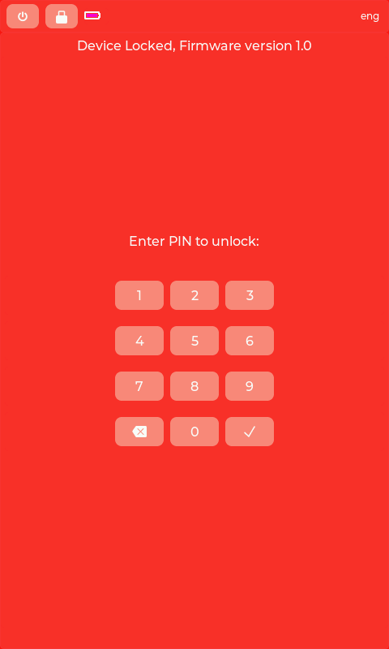

# Locked Screen

## Purpose
Prevents unauthorized access to device. Requires PIN to unlock.

## User Actions
- **Number keys (0-9)** - Enter PIN digits
- **Delete (backspace)** - Remove last digit
- **OK (checkmark)** - Submit PIN to unlock

## Security Context
- PIN masked with asterisks during entry
- Max 8 digits
- Wrong PIN clears input (no retry counter shown in MockUI)
- Duress PIN can trigger special action if configured

## State Requirements
- `is_locked: true` - Device must be locked
- Shown automatically when device locks or on startup if locked