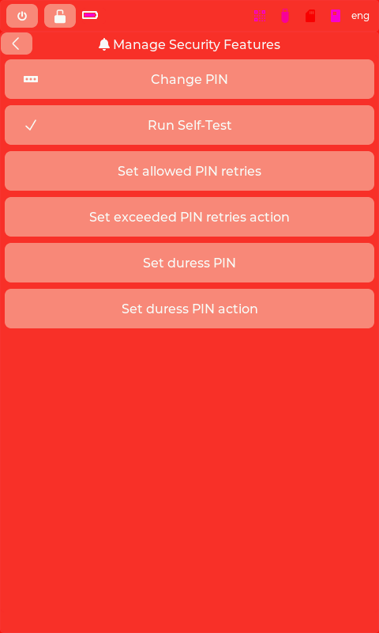

# Manage Security Features

## Purpose
Configure device security settings including PIN and duress protection.

## User Actions
- **Change PIN** - Update device unlock PIN
- **Run Self-Test** - Verify device integrity
- **Set allowed PIN retries** - Max wrong attempts before action
- **Set exceeded PIN retries action** - What happens on too many failures
- **Set duress PIN** - Alternate PIN that triggers duress action
- **Set duress PIN action** - What happens when duress PIN entered

## Security Context
Duress PIN allows user to appear compliant while triggering protective measures (wipe, fake wallet, alert).